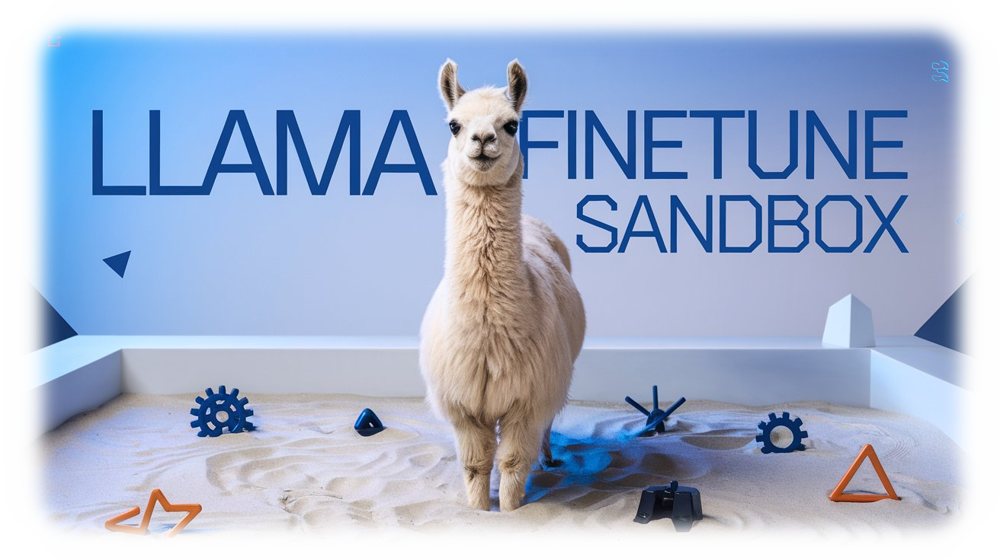

<p align="center">
  
  <h1 align="center">🌟 Llama-finetune-sandbox 🌟</h1>
</p>

<p align="center">
  <a href="https://github.com/Sunwood-ai-labs/Llama-finetune-sandbox">
    
  </a>
  <a href="https://github.com/Sunwood-ai-labs/Llama-finetune-sandbox/blob/main/LICENSE">
    
  </a>
  <a href="https://github.com/Sunwood-ai-labs/Llama-finetune-sandbox/stargazers">
    
  </a>
  <a href="https://github.com/Sunwood-ai-labs/Llama-finetune-sandbox/releases">
    
  </a>
</p>

<h2 align="center">
  ～ Llamaモデルのファインチューニング実験環境 ～
</h2>

<p align="center">
  
  
  
  
  
</p>

## 🚀 プロジェクト概要

**Llama-finetune-sandbox**は、Llamaモデルのファインチューニングを実験的に学習・検証できる環境です。様々なファインチューニング手法を試し、モデルのカスタマイズや性能評価を行うことができます。初学者から研究者まで、幅広いユーザーのニーズに対応します。

## ✨ 主な機能

1. **多様なファインチューニング手法**:
   - LoRA (Low-Rank Adaptation)
   - QLoRA (Quantized LoRA)
   - Full Fine-tuning
   - Parameter-Efficient Fine-tuning (PEFT)
   
2. **柔軟なモデル設定**:
   - カスタム可能な最大シーケンス長
   - 多様な量子化オプション
   - 複数のアテンションメカニズム

3. **実験環境の整備**:
   - 性能評価ツール
   - メモリ使用量の最適化
   - 実験結果の可視化

## 📚 実装例

本リポジトリには以下の実装例が含まれています：

1. **Unslothを使用した高速ファインチューニング**  
   - Llama-3.2-1B/3Bモデルの高速ファインチューニング実装  
     - → 詳細は [`Llama_3_2_1B+3B_Conversational_+_2x_faster_finetuning_JP.md`](sandbox/Llama_3_2_1B+3B_Conversational_+_2x_faster_finetuning_JP.md) をご参照ください。
     - → [マークダウン形式からノートブック形式への変換はこちらを使用してください](https://huggingface.co/spaces/MakiAi/JupytextWebUI)
   - [📒ノートブックはこちら](https://colab.research.google.com/drive/1AjtWF2vOEwzIoCMmlQfSTYCVgy4Y78Wi?usp=sharing)

2. その他の実装例は随時追加予定

## 🛠️ 環境構築

1. リポジトリのクローン:
```bash
git clone https://github.com/Sunwood-ai-labs/Llama-finetune-sandbox.git
cd Llama-finetune-sandbox
```

## 📝 実験例の追加方法

1. `examples/`ディレクトリに新しい実装を追加
2. 必要な設定やユーティリティを`utils/`に追加
3. ドキュメントとテストを更新
4. プルリクエストを作成

## 🤝 コントリビューション

- 新しいファインチューニング手法の実装
- バグ修正や機能改善
- ドキュメントの改善
- 使用例の追加

## 📚 参考資料

- [HuggingFace PEFT ドキュメント](https://huggingface.co/docs/peft)
- [Llama モデルについて](https://github.com/facebookresearch/llama)
- [ファインチューニングのベストプラクティス](https://github.com/Sunwood-ai-labs/Llama-finetune-sandbox/wiki)

## ⚖️ ライセンス

このプロジェクトはMITライセンスの下で公開されています。
